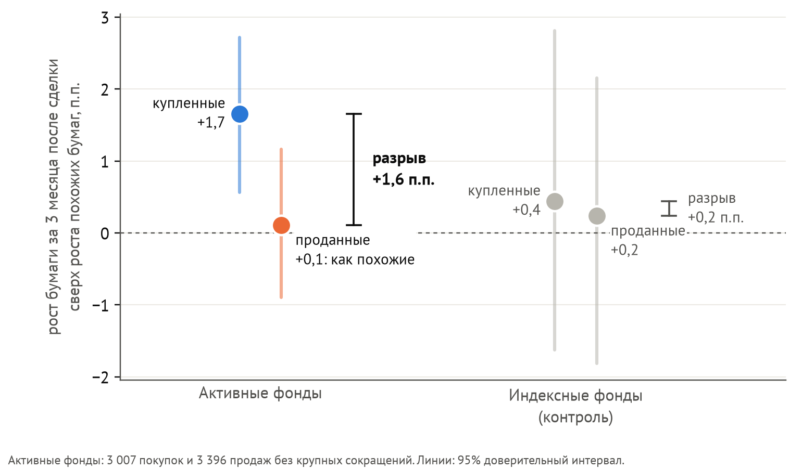
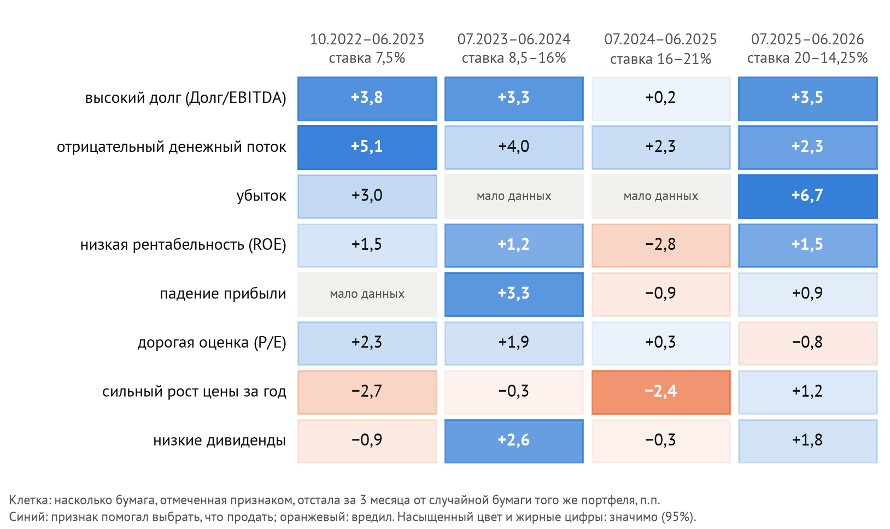
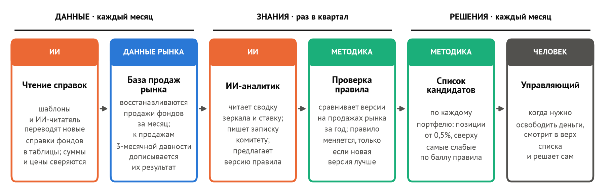
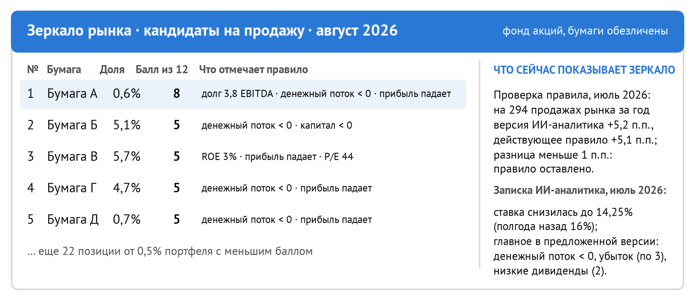
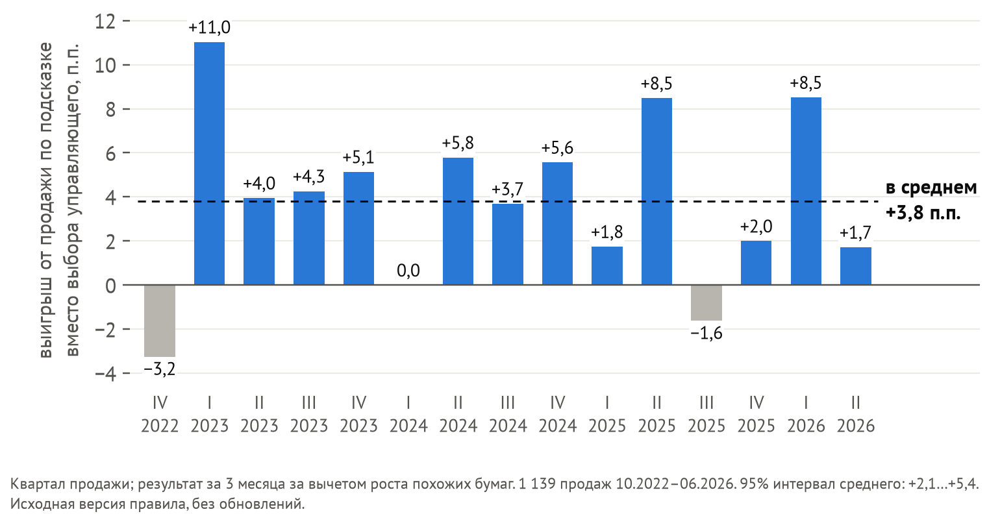

# Зеркало рынка

Код и данные к записке «Зеркало рынка: ИИ-агент, который помогает управляющему решить, что продать» (конкурс
«ИИ в управлении активами», УК «Ингосстрах-Инвестиции», 2026). Записка: [ЗАПИСКА.md](ЗАПИСКА.md).

Андрей Гладышев (капитан), Давид Басмаджян, Екатерина Гаврикова, Артем Чавгин, Александр Эдер · группа Э312

## Коротко

**Проблема.** 38 активных фондов акций, 10.2022–06.2026: купленные бумаги за три месяца обгоняют похожие на 1,7 п.п.,
проданные растут так же, как похожие (+0,1 п.п.). Продажи не приносят ничего, выбор бумаги для продажи не лучше жребия.



**Почему нужен весь рынок.** Признаки слабой бумаги работают не всегда, и по продажам одного фонда этого не увидеть.



**Решение.** ИИ-агент в трех контурах: данные (чтение справок), знания (квартальное обновление правила по зеркалу
рынка), решения (ежемесячный список кандидатов на продажу для каждого портфеля).





**Проверка на истории.** Правило, написанное моделью без данных, выбирает для продажи бумагу, которая за три месяца
отстает от выбранной управляющим на 3,8 п.п. [2,1; 5,4]; без крупных сокращений 3,5 п.п. [1,6; 5,2]; без любой одной
компании от 3,5 до 4,4 п.п. С ограничением размера позиции это около 0,7% стоимости портфеля в год (без издержек).



## Что сделано

1. Из ежемесячного раскрытия составов паевых фондов акций (PDF и Excel) собрана база позиций и сделок 11 управляющих
   компаний: 1 856 справок, прошедших сверку, 48 тыс. позиций, 27,5 тыс. сделок. Десять форматов читаются шаблонами,
   один читает языковая модель; её ответ проходит две арифметические проверки.
2. Каждая выборочная сделка оценена сравнением с похожими бумагами (тот же оборот торгов вместо размера и та же
   доходность за прошлый год, упрощённый метод Daniel и др., 1997) за три месяца после сделки. Способ проверен на
   индексных фондах: у них результат должен быть нулевым.
3. Проверено правило выбора бумаги для продажи, написанное моделью (Qwen 3.8 27B) без данных, и три варианта агента,
   который раз в квартал обновляет правило по данным зеркала и текущей ключевой ставке. С проверкой по году обновление
   не хуже неизменного правила в пределах погрешности, но и не лучше; по трём месяцам хуже.

**Исходное правило** (`данные/составы_фондов/правила_prior.json`) — три ответа модели на один запрос без данных
(`rulegen.py`, `prompt_prior`); баллы версий складываются (в записке и списках — средний балл, порядок тот же):
Долг/EBITDA > 3 и отрицательный FCF — по 3 балла в каждом ответе, ROE < 5% и падение прибыли — по 2, P/E > 20 — 1,
P/B > 2,5 — 1 в двух ответах, рост цены за 12 мес. > 50% — 1 в одном. При равенстве баллов продаётся бумага с
наибольшим ростом за 12 мес.

## Главные числа и как их получить

| Утверждение | Число | Команда (из `код/fundmirror`) | Результат |
|---|---|---|---|
| Купленные и проданные бумаги против похожих, 38 активных фондов, 10.2022–06.2026 | +1,66 и +0,11 п.п. за 3 мес. | `python3 figure_problem.py` | `рисунки/числа_проблема.json` |
| Разрыв «купленные минус проданные» при трёх способах подбора похожих бумаг: активные; индексные | +1,55; +0,85; +2,42; у индексных +0,21; +0,50; +1,09 (незначимо) | `python3 figure_problem.py` | `рисунки/числа_проблема.json` |
| Индексные фонды против индекса МосБиржи: выходы; сокращения до 7% | −3,94 [−7,28; −0,70]; −1,91 [−3,52; −0,27] | `python3 figure_problem.py` | `рисунки/числа_проблема.json` |
| Проданная бумага против трёх случайных бумаг того же портфеля; без крупных сокращений | +0,94 [−0,46; +2,37]; −0,01 [−2,03; +1,76] | `python3 solution_adj.py` | `рисунки/числа_правило.json` |
| Правило «без данных» против выбора управляющего: 1 139 продаж; без 423 крупных сокращений | +3,81 [+2,06; +5,40]; +3,50 [+1,59; +5,17] | `python3 solution_adj.py` | `рисунки/числа_правило.json` |
| Экономика с ограничением размера позиции (выборочные продажи — медиана 2,71% стоимости акций фонда в месяц) | 2,2 п.п. на рубль продажи; около 0,7% портфеля в год | `python3 solution_adj.py` | `рисунки/числа_правило.json` |
| Какие признаки слабой бумаги работали в разные периоды | рисунок 2 | `python3 figure_mirror.py` | `рисунки/числа_признаки.json` |
| Агент, проверка версий по трём месяцам: против управляющих и против неизменного правила | +2,09 [+1,04; +3,17] и −1,89 [−3,48; −0,31] | `python3 agent_rate.py score` | `данные/составы_фондов/агент_ставка/итог.json`, `рисунки/агент_ставка.png` |
| Агент, проверка версий по году (Б) и ИИ, читающий сводку зеркала (М): против управляющих; против неизменного правила | Б +3,46 [+1,72; +5,25], −0,52 [−1,24; +0,19]; М +2,88 [+1,51; +4,14], −1,10 [−2,17; +0,07] | `python3 agent_mirror.py score` | `данные/составы_фондов/агент_зеркало/итог.json`, `рисунки/агент_зеркало.png` |
| Конфигурация месячного цикла (версии М, отбор по году, замена при превосходстве на 1 п.п.; выбрана после основных вариантов) | +3,24 [+1,64; +4,70]; против неизменного −0,74 [−1,52; +0,07]; без порога +3,65 [+2,24; +5,02] | `python3 agent_mirror.py score` | `данные/составы_фондов/агент_зеркало/итог.json` |
| Разбор агента: без выключателя; всегда новая версия; неизменное правило на последнем году перед кварталом | +3,32; +3,23; от +2,75 до +6,15 | `python3 agent_diag.py` | вывод в консоль |
| Моментум признаков на всём рынке: наклон пользы на историю; признаки с хорошей историей против всех; подвижное сочетание против исходного; польза исходного правила на всех бумагах | −0,06 [−0,43; +0,37]; +0,45 [+0,02; +0,88]; −1,13 [−2,62; +0,48]; +2,54 [−0,04; +5,07] | `python3 signal_momentum.py test` | `данные/составы_фондов/моментум_признаков.json` |
| Точность ИИ-читателя: 30 справок 10 компаний; трудный формат | 750 из 750 строк; 11 из 15 справок | `python3 reader_accuracy.py score` (и `hard_score`) | вывод в консоль |
| Учёт финансовой слабости (выборка раздела 3): полные выходы и частичные сокращения | 479 и 2 831 продажа; перцентиль 0,60 и 0,50 | `python3 knowledge_check.py` | `знание_стресса.json` |
| Неоднородность: без одной компании, бутстрэп по фондам, рисунок 2 | 3,5–4,4 п.п.; знак клеток не меняется | `python3 hetero_check.py` | `неоднородность.json` |

Интервалы 95%, блочный бутстрэп по месяцам (блок 3 месяца, `rule.block_boot`: одна и та же величина получает один
интервал в любом скрипте); в `hetero_check.py` — ещё и бутстрэп по фондам. В проверке правила доходности очищены так
же, как в оценке сделок: из роста бумаги вычитается рост похожих бумаг (`cases.py`). Крупное сокращение — частичная
продажа позиции от 7% портфеля: в оценке сделок (раздел 3) такие продажи не участвуют, в проверке правила (раздел 6)
приведены обе выборки.

## Планы проверки агента

Гипотезы и порядок проверки ниже были сформулированы до расчёта соответствующих итогов. В репозитории одна итоговая
фиксация, поэтому порядок работ по истории коммитов проверить нельзя.

**`agent_rate.py`.** Каждый квартал с июля 2023 по апрель 2026 года (12 кварталов) модель получает только дату,
ключевую ставку на эту дату и полгода назад и 40 случайных продаж рынка с известным исходом за последние 12 месяцев;
три попытки дают три версии, баллы которых складываются. Новая версия заменяет действующую, если лучше неё на продажах
трёхмесячной давности; если обе хуже выбора управляющего, подсказки выключаются на квартал. Стартовое правило: «без
данных». Гипотезы: H1, агент лучше выбора управляющих; H2, агент лучше неизменного правила. Итог: H1 подтверждена
(+2,09), H2 нет (−1,89), разбор в `agent_diag.py`. План предусматривал 60 продаж на попытку; до первого результата
выборка уменьшена до 40, потому что запрос из 60 продаж модель обрабатывала около 14 минут.

**`agent_mirror.py`.** Вариант М: модель каждый квартал получает дату, ставку и сводку зеркала по 13 признакам
(насколько бумага с самым выраженным признаком отставала от случайной бумаги того же портфеля за последний год и за год
до него, с числом случаев и квартилями) и пишет правило на квартал. Вариант Б: версии прогона `agent_rate.py`
отбираются по году продаж вместо трёх месяцев. Гипотезы: М лучше управляющих; М лучше неизменного правила; Б лучше
неизменного правила. Итог: первая да, две другие нет (различия незначимы). Конфигурация месячного цикла (М с отбором по
году) и порог замены 1 п.п. выбраны после этих итогов; их результат приведён в таблице отдельно.

**`signal_momentum.py`.** Весь рынок, каждый месяц все бумаги из портфелей фондов: продолжают ли работать
признаки, которые работали последний год; лучше ли признаки с хорошей историей; обыгрывает ли подвижное сочетание
признаков исходное правило. Итог: нет; слабо да (+0,45 п.п.); нет.

## Ежемесячный цикл (раздел 5 записки)

```
cd код/fundmirror
python3 mirror_cycle.py 2026-08                 # решения: списки кандидатов на продажу по всем активным фондам
python3 mirror_cycle.py 2026-07 --llm           # начало квартала: ещё и записка ИИ-аналитика и проверка новой версии правила
python3 mirror_cycle.py 2026-10 --fetch --llm   # полный месяц: докачать справки всех УК, прочитать, обновить цены и сделки
```

Один запуск выполняет три контура. Данные: новые справки, их чтение (шаблоны и ИИ-читатель с двумя проверками), сделки;
продажи, исход которых стал известен, добавляются в зеркало. Знания (в начале квартала): сводка зеркала, записка
ИИ-аналитика, новая версия правила; она заменяет действующую, только если лучше хотя бы на 1 п.п. на продажах рынка за
год (`rule.MARGIN`), а если действующее правило на том же году хуже выбора управляющих, подсказки выключаются. Решения:
по каждому активному фонду позиции от 0,5% портфеля с отчётностью, упорядоченные по баллу правила. В сводке выпуска
также покупки и продажи каждой управляющей компании за последний год на фоне рынка. Выпуски за июль и август 2026 года
лежат в `данные/зеркало/выпуски/` (`сводка.md`, `списки.md`, `списки.csv`), история квартальных проверок (записка
ИИ-аналитика и предложенная версия правила) — в `данные/составы_фондов/зеркало_состояние.json`. В июле 2026 года
предложенная версия была лучше действующей на 0,04 п.п., поэтому правило оставлено исходным. Рисунок 4 записки
строится из выпуска (`python3 figure_card.py 2026-08`).

Повторный запуск любого месяца без `--llm` воспроизводит выпуск: правило месяца восстанавливается по истории проверок,
а для квартального месяца берутся уже сохранённые записка и версия правила.

## Структура

```
ЗАПИСКА.md                 записка
рисунки/                    рисунки записки (рис1–рис5), рисунки агента и числа, по которым они построены
код/fundmirror/             код (описание ниже)
данные/составы_фондов/      позиции, сделки, цены, случаи продаж, правило, решения агента, справки для проверки читателя
данные/зеркало/выпуски/     выпуски ежемесячного цикла
данные/key_rate_changes.txt ключевая ставка Банка России
```

Основные модули:

- `fetch.py`, `parse_scha.py`, `parse_all.py`, `llm_read.py`: загрузка справок, разбор шаблонами и ИИ-читателем, проверки;
- `trades.py`, `prices.py`, `turnover.py`: сделки из соседних справок; цены и обороты Московской биржи, дивиденды smart-lab.ru;
- `mirror_bench.py`, `figure_problem.py`: оценка сделок относительно похожих бумаг, контроль на индексных фондах, рисунок 1;
- `sellrank.py`, `cases.py`: случаи продаж (проданная бумага и три случайные бумаги того же портфеля с отчётностью) и их
  очищенные доходности;
- `rulegen.py`, `rule.py`: признаки, исходное правило, выбор бумаги по правилу, блочный бутстрэп;
- `solution_adj.py`, `figure_mirror.py`, `hetero_check.py`, `knowledge_check.py`: проверка правила, экономика,
  неоднородность, рисунки 2 и 5;
- `agent_rate.py`, `agent_mirror.py`, `agent_diag.py`: варианты агента (новая версия правила раз в квартал, выбор
  версии, выключатель) и разбор результата; `signal_momentum.py`: проверка на всём рынке;
- `mirror_cycle.py`, `figure_card.py`, `figure_scheme.py`: месячный цикл, список кандидатов на продажу для реального
  фонда (бумаги обезличены) и схема контуров;
- `reader_accuracy.py`: точность ИИ-читателя; `test_core.py`: тесты; `md2pdf.py`, `text_check.py`: PDF записки и объём.

## Как воспроизвести

Нужны Python 3.11+, `pip install -r requirements.txt`, `pdftotext` (poppler), шрифт PT Sans (рисунки) и Google Chrome
(только для PDF записки).

```
cd код/fundmirror
python3 test_core.py            # тесты правила, бутстрэпа, дат дивидендов, отчётности и ставки
python3 figure_problem.py       # рисунок 1 и числа проблемы
python3 solution_adj.py         # проверка правила, экономика, рисунок 5
python3 figure_mirror.py        # рисунок 2
python3 figure_scheme.py        # рисунок 3
python3 figure_card.py 2026-08  # рисунок 4 из выпуска цикла
python3 hetero_check.py         # неоднородность по фондам и компаниям
python3 agent_rate.py score     # итог агента по сохранённым решениям (модель не нужна)
```

Сохранённые решения агента (`данные/составы_фондов/агент_ставка/`, `агент_зеркало/`) содержат ответы модели, поэтому
проверка итогов не требует модели. Заново прогнать агента (`python3 agent_rate.py run` после удаления файлов кварталов)
и ИИ-читателя можно с открытой моделью Qwen 3.8 27B в LM Studio (порт 50255). Сырые справки целиком (около 760 МБ) не
включены, их скачивает `fetch.py`; справки, на которых проверялся ИИ-читатель, лежат в `данные/составы_фондов/raw/`.

Если поменялись цены или дивиденды: `python3 trades.py` (сделки), затем `python3 sellrank.py rebuild` (описания и
исходы тех же случаев продаж), затем команды выше.

## Ограничения запуска и данных

- `fetch.py` скачивает справки 9 управляющих компаний; справки «Первой» и «Ингосстраха» их сайты отдают только браузеру,
  они загружаются вручную в `данные/составы_фондов/raw/` и дописываются в `опись.csv`. Сертификаты сайтов проверяются;
  если сайт отдаёт цепочку, которую не удаётся проверить, запрос повторяется без проверки и это печатается.
- Для `--fetch` нужен доступ к сайтам управляющих компаний, Московской биржи и smart-lab.ru; для `--llm` и ИИ-читателя
  нужна открытая модель Qwen 3.8 27B в LM Studio (порт 50255).
- Без флагов цикл работает на данных репозитория и воспроизводит выпуски из `данные/зеркало/выпуски/`.
- Дивиденд относится к окну доходности по первому дню торгов без него: до 31.07.2023 (расчёты T+2) — рабочий день
  перед датой реестра, позже — сама дата реестра; праздники не учитываются.
- Сделка определяется по двум соседним справкам на конец месяца: сделки внутри месяца и точная дата сделки не видны,
  исход считается от даты справки.

## Источники данных

Раскрытие составов паевых фондов на сайтах управляющих компаний; цены и обороты: ISS Московской биржи; дивиденды и
годовая отчётность компаний (МСФО): smart-lab.ru; ключевая ставка: Банк России.

## Использование ИИ

ИИ-ассистент Claude использовался для кода, анализа данных и черновиков текста; модели Qwen и DeepSeek были объектом
исследования. Постановка задачи, выбор метода, проверка результатов и выводы ИИ не передавались.
