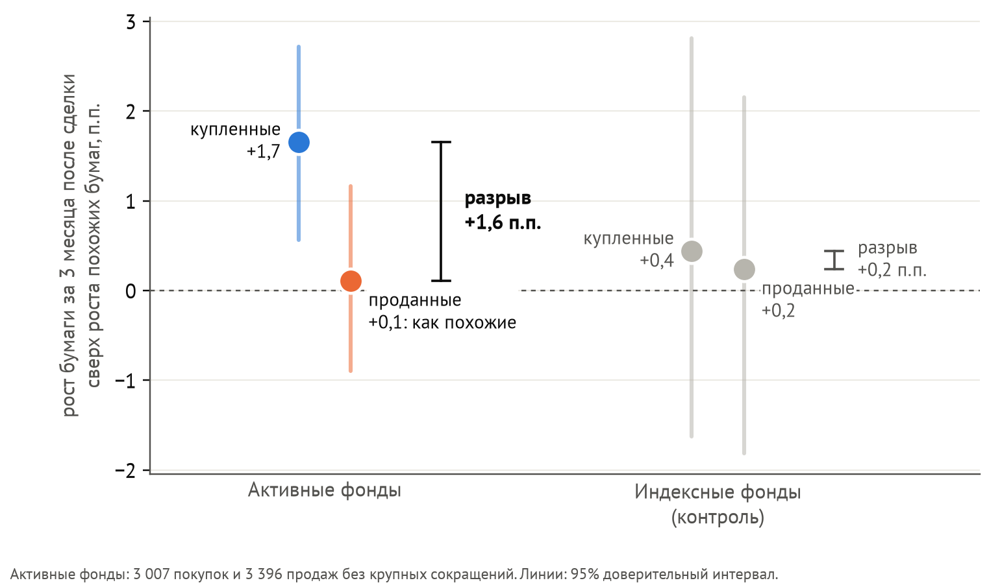
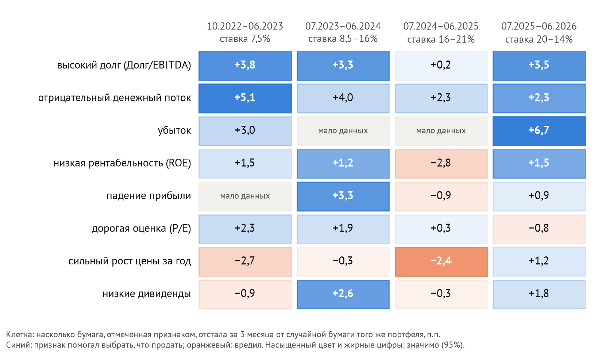
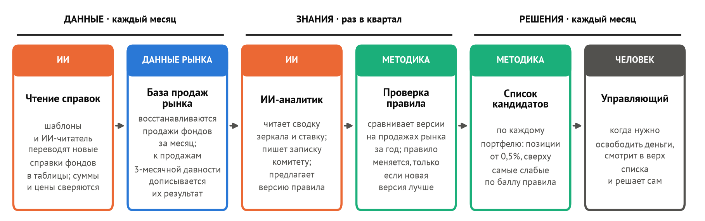
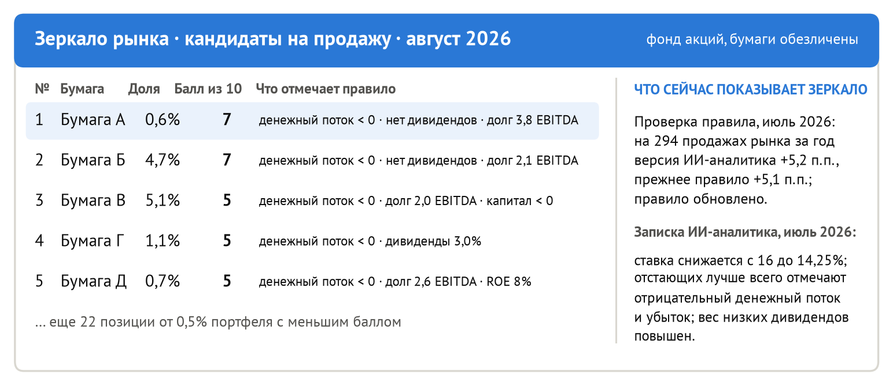
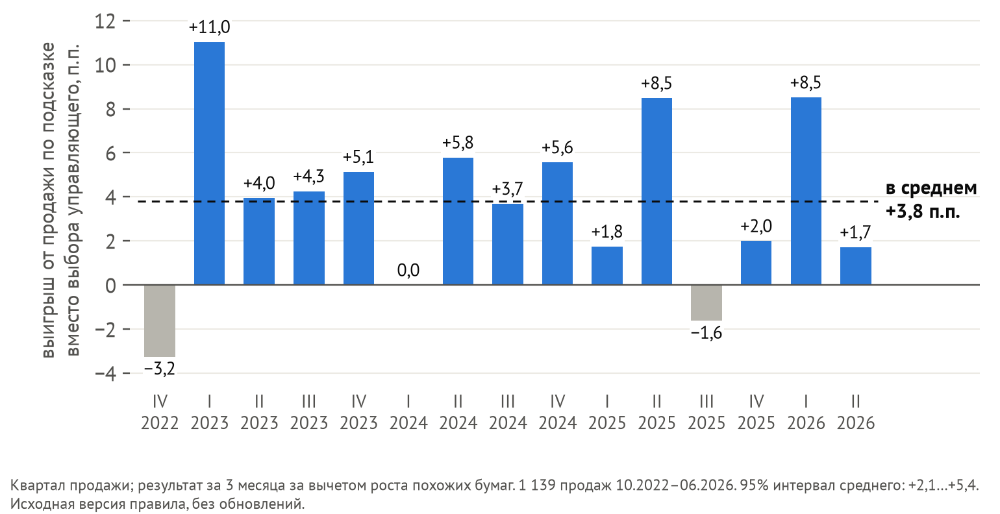

# Зеркало рынка: ИИ-агент, который помогает управляющему решить, что продать

Андрей Гладышев (капитан), Давид Басмаджян, Екатерина Гаврикова, Артем Чавгин, Александр Эдер · группа Э312

Код и данные: https://github.com/andreygladyshev-econ/fund-mirror

## 1. Проблема

Итоговая доходность фонда не показывает, что ее создает: решения о покупке или о продаже. На закрытых данных американских институциональных инвесторов ответ получен: покупки
приносят доходность, а продажи уступают даже продаже случайной бумаги того же портфеля (Akepanidtaworn и др., 2023).
По выводу авторов, внимание уходит на поиск идей для покупки, а продаваемую бумагу выбирают по упрощенным признакам. Данные для статьи
собрала компания Inalytics; по ее оценке, неудачные продажи стоят около одного процентного пункта доходности в год.

В России такой базы нет, но есть обязательное ежемесячное раскрытие составов паевых фондов. Из него построено «зеркало
рынка»: база сделок фондов с их результатами. На нем работает предлагаемый ИИ-агент.

## 2. Как построено зеркало рынка: данные и ИИ

Каждый фонд раз в месяц публикует справку с полным составом портфеля. Сделка восстанавливается как изменение
количества бумаги между соседними справками. Месяцы, когда фонд меняет больше половины позиций, исключаются: это
приток или отток денег клиентов, а не выбор бумаги. Остальные сделки называются выборочными.

Справки выходят в PDF и Excel разной верстки: для 10 управляющих компаний написаны шаблоны, одиннадцатую
прочитал ИИ-читатель (языковая модель). На проверочных 30 справках
он без шаблона извлек все 750 строк без ошибок, на самом трудном формате прошел проверки в 11 справках из 15.
Ответ модели сверяется с итогом справки и биржевыми ценами; сомнительное уходит человеку. В зеркале 11 компаний, 1 856 справок и 27,5 тыс. сделок.

**Как оценивается сделка.** Вместо проданной акции фонд мог продать похожую, вместо купленной купить похожую. Поэтому считается, насколько бумага за следующие три месяца выросла быстрее похожих. Для покупки это хорошо, для продажи плохо: если
проданная выросла на 8%, а похожие на 3%, продажа стоила фонду 5 процентных пунктов (п.п.). Похожими считаются акции того
же размера и с той же доходностью за прошлый год: эти свойства сами влияют на рост (Daniel и др., 1997).
Способ проверен на индексных фондах: они бумаги не выбирают, и оценка для них, как и должна, около нуля, а
сравнение с индексом МосБиржи находит у них несуществующий выигрыш.

## 3. Что показало зеркало: продажи не лучше жребия

За 45 месяцев, с октября 2022 по июнь 2026 года, 38 активных фондов акций совершили 3 007 выборочных покупок и
3 396 выборочных продаж (без крупных сокращений, раздел 7).

- **Покупки приносят доход.** Купленная бумага за три месяца выросла в среднем на 1,7 п.п. больше похожих (95%
   доверительный интервал от 0,6 до 2,7).
- **Продажи не приносят ничего.** Удачная продажа избавляет фонд от бумаги, которая потом отстает от
   похожих. У фондов проданная бумага выросла на 0,1 п.п. больше похожих (интервал от −0,9 до +1,2), то
   есть так же: продажа похожей бумаги дала бы тот же результат.
- **Жребий внутри портфеля справился бы не хуже.** Проданная бумага выросла на 0,9 п.п. больше, чем в среднем
   три случайные другие бумаги того же портфеля (незначимо; 1 139 продаж с отчетностью по всем четырем).

Купленные бумаги обгоняют проданные на 1,6 п.п. за квартал; при двух других способах подбора похожих бумаг разрыв
0,9 и 2,4 п.п., у индексных фондов он близок к нулю (рисунок 1). Умение выбирать бумаги, заметное в покупках, в продажах
не проявляется.

## 4. Почему нужен весь рынок

Признаки финансовой слабости компании (высокий долг, отрицательный денежный поток, низкая рентабельность) хорошо известны
аналитикам, и при полном выходе из бумаги управляющие на них опираются: проданная бумага по этим признакам слабее
60% других позиций портфеля. Но полные выходы составляют лишь седьмую часть продаж (494 из 3 396). При
частичном сокращении позиции проданная бумага по признакам слабости не отличается от случайной позиции того же
портфеля, и так в каждом году. В 2024–2025 годах выбор бумаги для продажи оказался даже хуже жребия (на 2,4
п.п.). Поэтому задача не в поиске нового правила: известные признаки должны быть перед глазами в момент каждой
продажи, а их работу нужно регулярно проверять.

Признаки слабости надежны не всегда (рисунок 2). Высокий долг помогал выбрать, что
продать, в трех периодах из четырех, но не в 2024–2025 годах, когда продажа сильно выросших за год бумаг даже вредила. Сочетание признаков устойчивее (лучше жребия во всех четырех периодах), но и его надо проверять по сотням недавних продаж, а у одного фонда их около 25
в год: даже по всем фондам одной компании интервал оценки шире самого эффекта. Такую проверку дает только зеркало всего рынка.

## 5. Решение: ИИ-агент «Зеркало рынка»

**Правило** состоит из признаков с баллами: чем выше балл бумаги, тем она слабее. Исходную версию ИИ-аналитик (модель Qwen 3.8 27B) написал из знаний финансовой науки, не
видя данных и периода: долг больше трех годовых EBITDA (3 балла), отрицательный свободный денежный поток (3),
рентабельность капитала ниже 5% (2), падение прибыли (2), P/E больше 20 и P/B больше 2,5 (по 1; в одном из трех ответов вместо P/B рост цены за год больше 50%). Это известный признак финансового стресса (Campbell и др., 2008).

Агент работает в трех контурах (рисунок 3).

1. **Данные, каждый месяц.** Новые справки переводятся в таблицы шаблонами и ИИ-читателем, программа
   пополняет зеркало продажами и дописывает результат продаж, сделанных три месяца назад.
2. **Знания, раз в квартал.** ИИ-аналитик читает сводку зеркала (какие признаки помогали за последние годы) и
   текущую ставку, пишет комитету записку и предлагает новую версию правила. Программа сравнивает ее с действующей на
   продажах рынка за год; правило меняется, только если новая версия лучше, а если не работает ни одна, подсказки
   выключаются.
3. **Решения, каждый месяц.** Программа строит для каждого портфеля список лучших кандидатов на продажу: позиции от
   0,5% портфеля по убыванию балла действующего правила, с признаками, которые сработали (рисунок 4). Когда нужно
   освободить деньги под покупку или отток, управляющий смотрит в верх списка и решает сам.

## 6. Проверка на истории

Правило проверено на тех же 1 139 продажах и тех же четырех бумагах.

- Если бы фонд продавал бумагу, выбранную исходным правилом, а не управляющим, он получал бы
   за три месяца в среднем на 3,8 п.п. больше на рубль продажи (интервал от 2,1 до 5,4). Выигрыш был в 36 месяцах из
   45 и в 12 кварталах из 15 (рисунок 5); без первого полугодия 2026 года, когда рынок наказал слабые компании, 3,5 п.п.
- Правило лучше и жребия среди тех же четырех бумаг: на 3,1 п.п. (от 1,7 до 4,4).
- Результат не держится на одной компании: без любой из десяти он от 3,5 до 4,4 п.п.
- Квартальное обновление правила ИИ-аналитиком проверено на 880 продажах с июля 2023 года: 3,7 п.п. (от 2,2 до 5,1)
   против 4,0 у неизменного правила, разница незначима. Эта конфигурация цикла проверена после заранее описанных
   вариантов (2,9–3,5); отбор версий по трем месяцам вместо года хуже: 2,1 п.п.

**Ожидаемый эффект.** Правило чаще предлагает меньшие позиции (3,0% портфеля против 6,0% у проданных), а замена ограничена
размером позиции; с этим ограничением выигрыш 2,2 п.п. за квартал на рубль выборочных продаж. Типичный фонд
продает выборочно около 2,7% портфеля в месяц, отсюда около 0,7% стоимости портфеля в год при полном следовании
подсказкам (70 млн ₽ на портфель в 10 млрд ₽).

## 7. Критика решения

1. **Проверка пришлась в основном на высокую ставку** (8,5–21%); при ставке 7,5% в 2022–2023 годах результат
   неустойчив (+3,2 п.п., интервал от −1,0 до +8,6).
2. **Модель могла помнить рынок проверочных лет** Риск мал: исходное
   правило написано без данных и без указания периода, бумаги обезличены, баллы считает программа. Его снимет проверка вперед (второй шаг пилота).
3. **Обновление правила ИИ-аналитиком пока не добавило доходности:** исходный набор признаков в 2022–2026 годах
   работал устойчиво, а смены режима, от которой квартальное обновление страхует, почти не было.
4. **Крупные сокращения** (позиций от 7% портфеля, 45% объема продаж) не оцениваются: для них способ не проходит
   проверку на индексных фондах.

## 8. Внедрение и пилот

**Пользователи.** Управляющий раз в месяц получает список кандидатов на продажу; инвестиционный комитет получает
записку ИИ-аналитика и отчет о продажах команды на фоне рынка. От компании нужны только портфели.

**Где работает.** Цикл реализован программой: выпуск за август
2026 года построен ею для 37 фондов. В «Ингосстрахе» с 2026 года действует конструктор ИИ-агентов IMAN с внутренним контуром: он дает инструменты, зеркало дает содержание (базу продаж рынка, оценку сделок и
правило).

**Пилот.** Первый шаг (4–6 недель): подсказки задним числом на сделках компании за 3–5 лет по всем портфелям,
включая доверительное управление и страховые резервы. Второй шаг (3 месяца): подсказки идут параллельно обычным
решениям.

## 9. Декларация использования ИИ

ИИ-ассистент Claude использовался для кода, анализа данных и черновиков текста; модели Qwen и DeepSeek были объектом
исследования. Постановка задачи, выбор метода, проверка результатов и выводы ИИ не передавались.

## Литература

Akepanidtaworn K., Di Mascio R., Imas A., Schmidt L. Selling Fast and Buying Slow // Journal of Finance. 2023.
Campbell J., Hilscher J., Szilagyi J. In Search of Distress Risk // Journal of Finance. 2008.
Daniel K., Grinblatt M., Titman S., Wermers R. Measuring Mutual Fund Performance with Characteristic-Based Benchmarks // Journal of Finance. 1997.
Inalytics. Selling Fast and Buying Slow. 2018.
«Ингосстрах» запустил корпоративную платформу IMAN для создания ИИ-агентов // ingos.ru. 2026.
